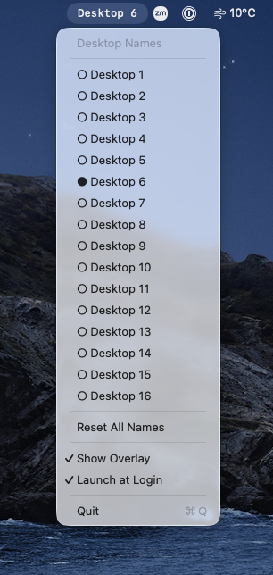
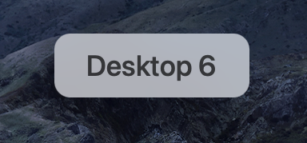
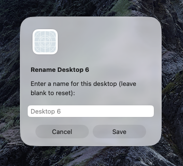

<p align="center">
  
  &nbsp;&nbsp;
  
  &nbsp;&nbsp;
  
</p>

# DesktopNamer

A lightweight macOS menu bar app that lets you name your virtual desktops (Spaces) and shows the current desktop name at a glance.

## Features

- **Menu bar display** — always shows the name of the current desktop in the status bar
- **HUD overlay** — flashes the desktop name when switching spaces, then fades away
- **Rename desktops** — click the menu bar item to rename any desktop
- **Launch at Login** — toggle from the menu to start automatically
- **Persistent names** — desktop names survive restarts and reordering
- **Zero dependencies** — pure Swift + AppKit, no third-party libraries

## Install

### Download

Download the latest `DesktopNamer.dmg` from [Releases](https://github.com/roobert/osx-desktop-namer/releases), open it, and drag to `/Applications`.

### Build from source

```bash
git clone https://github.com/roobert/osx-desktop-namer.git
cd osx-desktop-namer
make run
```

Requires Xcode Command Line Tools and macOS 13+.

## Usage

1. The current desktop name appears in your menu bar
2. Switch desktops (Ctrl+←/→, trackpad swipe, or Mission Control) to see the overlay flash
3. Click the menu bar item to see all desktops and rename them
4. Toggle **Launch at Login** to start automatically

Desktop names are stored in `~/Library/Application Support/DesktopNamer/config.json`.

## How it works

DesktopNamer uses private CoreGraphics APIs (`CGSGetActiveSpace`, `CGSCopyManagedDisplaySpaces`) to detect which Space is active and enumerate all Spaces. It listens for `NSWorkspace.activeSpaceDidChangeNotification` to react to space switches.

Since these are private APIs, they could break in a future macOS update. The app performs runtime symbol checks and degrades gracefully if the APIs become unavailable.

## Release

Releases are built, signed, notarized, and published automatically via GitHub Actions when a version tag is pushed:

```bash
git tag v1.0.0
git push origin v1.0.0
```

## License

MIT
